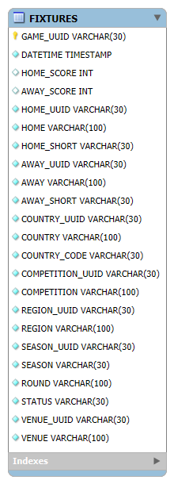
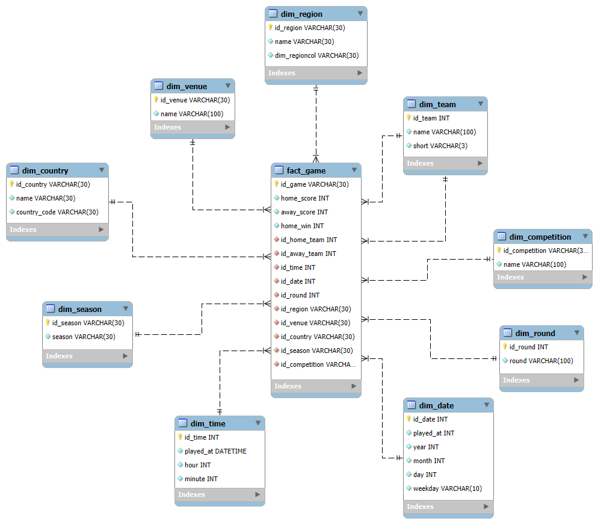
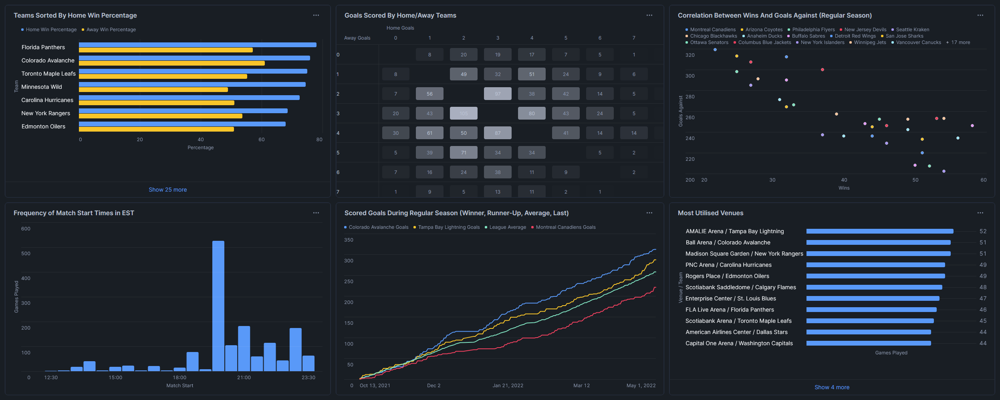

# **ELT proces datasetu OptaData: Ice Hockey Schedule and Results Data**

Cieľom tohto repozitáru je analyzovať výsledky sezóny 2021/22 NHL. Pracujeme s OptaData datasetom. Skúmame vplyv a závislosť rôznych faktorov na výsledky zápasov. Náš model umožňuje podrobnú analýzu výsledkov sezóny a tvorbu vizualizácií.

---
## **1. Úvod a popis zdrojových dát**
V našom projekte analyzujeme dáta o výsledkoch zápasov sezóny 2021/22 zámorskej NHL. Cieľom je analyzovať:
- Časy zápasov
- Výsledky zápasov
- Gólovú produktivitu tímov
  
Zdrojové dáta pochádzajú zo snowflake datasetu dostupného [tu](https://app.snowflake.com/marketplace/listing/GZSVZCB6A7). Dáta sú uložené v denormalizovanej tabuľke, ktorá obsahuje údaje o:
- `game` - údaje o zápase
- `home / away` - údaje o zúčastnených tímoch
- `country` - krajina súťaže
- `region` - región súťaže
- `season` - sezóna súťaže
- `venue` - štadión, kde bola hra odohraná

---
### **1.1 Dátová architektúra**

### **OBT diagram**
Surové dáta sú uložené ako model One Big Table, ktorý je znázornený na **diagrame**:

<p align="center">
  
  <br>
  <em>Obrázok 1 - OBT schéma datasetu OptaData: Ice Hockey Schedule and Results Data</em>
</p>

---
## **2 Dimenzionálny model**

Pre projekt sme si vybrali star schému (Kimball), pretože nám prišla vhodnejšia na uchovanie našich pôvodných dát a ich následnú analýzu.
**`fact_game`**, ktorá je prepojená s nasledujúcimi 9 dimenziami:
- **`dim_team`**: Obsahuje údaje o tímoch.
- **`dim_region`**: Obsahuje údaje o regióne.
- **`dim_competition`**: Obsahuje údaje o súťaži.
- **`dim_round`**: Obsahuje údaje o kolách (pre-season, regular, play-off, finale).
- **`dim_date`**: Obsahuje údaje o dátumoch.
- **`dim_time`**: Obsahuje údaje o časoch.
- **`dim_season`**: Obsahuje údaje o sezóne.
- **`dim_country`**: Obsahuje údaje o štátoch.
- **`dim_venue`**: Obsahuje údaje o štadiónoch.

Štruktúra našej star schémy je znázornená nižšie. Diagram ukazuje prepojenia medzi faktovou tabuľkou a dimenziami.

<p align="center">
  
  <br>
  <em>Obrázok 2 - Star schéma pre dáta z datasetu OptaData: Ice Hockey Schedule and Results Data</em>
</p>

---
## **3. ELT proces v Snowflake**
ELT proces tvoria 3 časti:
Prvou je **`Extract`** - získanie dát zo zdroja a ich uloženie do dočasného staging prostredia databázy, pre overenie dátovej integrity.
Druhou je **`Load`** - vloženie dát do cieľovej destinácie, kde sú pripravené na analýzu.
Treťou je **`Transform`**, kde sa dáta menia podľa potrieb analýzy, prípadne sa pridávajú potrebné spojenia a výpočty.

---
### **3.1 Extract (Extrahovanie dát)**
Dáta zo zdrojového datasetu boli najprv nahraté do Snowflake prostredníctvom Snowflake Marketplace.

---
### **3.2 Load (Načítanie dát)**

Pre OBT z datasetu sme vytvorili jednu staging tabuľku, do ktorej sme z nej skopírovali údaje pomocou `CREATE TABLE - AS SELECT - FROM` 

#### Príklad kódu:
```sql
CREATE OR REPLACE TABLE table_staging AS 
    SELECT * FROM opta_data_ice_hockeysample_tapir_opossum.ice_hockey.fixtures;
```

---
### **3.3 Transform (Transformácia dát)**

V tejto fáze sme sa zamerali na vytvorenie dimenzií a faktovej tabuľky.

```sql
CREATE OR REPLACE TABLE dim_team AS (
    SELECT DISTINCT
        home_uuid AS id_team,
        home AS name,
        home_short AS team_short
    FROM table_staging
);

CREATE OR REPLACE TABLE dim_venue AS (
    SELECT DISTINCT
        venue_uuid AS id_venue,
        venue AS name
    FROM table_staging
);
```
Dimenzia `dim_team` je navrhnutá tak, aby uchovávala informácie o tímoch zúčastnených v lige, ich názvoch a skratkách. V našom modeli je navrhnutá ako `SCD Typ 0`. Ak by sme chceli sledovať zmeny naprieč sezónami, použili by sme `SCD Typ 2` - aby sme sledovali zmenu názvu tímu.

Tabuľka `dim_venue` obsahuje iba názov štadióna, tak isto by mohla byť `SCD Typ 2` v prípade zmeny názvu, ak by sme sledovali viac sezón. V našom modeli je `SCD Typ 0`.

```sql
CREATE OR REPLACE SCHEMA TAPIR_DB.projekt;
USE WAREHOUSE TAPIR_WH;
USE SCHEMA projekt;

CREATE OR REPLACE TABLE table_staging AS 
SELECT * FROM opta_data_ice_hockeysample_tapir_opossum.ice_hockey.fixtures;

SELECT * FROM table_staging
ORDER BY round;

CREATE OR REPLACE TABLE dim_season AS (
    SELECT DISTINCT
        season_uuid AS id_season,
        season AS season
    FROM table_staging
);

CREATE OR REPLACE TABLE dim_region AS (
    SELECT DISTINCT
        region_uuid AS id_region,
        region AS region
    FROM table_staging
);

CREATE OR REPLACE TABLE dim_country AS (
    SELECT DISTINCT
        country_uuid AS id_country,
        country AS name,
        country_code AS country_code
    FROM table_staging
);

CREATE OR REPLACE TABLE dim_competition AS (
    SELECT DISTINCT
        competition_uuid AS id_competition,
        competition AS competition
    FROM table_staging
);

CREATE OR REPLACE TABLE dim_round AS (
    SELECT DISTINCT
        DENSE_RANK() OVER (
            ORDER BY round
        ) AS id_round, 
        round AS round
    FROM table_staging
);
```

Tieto tabuľky zaznamenávajú sezónu, región, krajinu, súťaž a kolo. Všetky sú `SCD Typ 0`, pretože tieto údaje sa nemenia.
V tabuľke `dim_round` sme vytvorili primary key pomocou window funkcie `DENSE_RANK()`.

```sql
CREATE OR REPLACE TABLE dim_time AS (
SELECT DISTINCT
    TIME(date_time)::TIME(0) AS id_time,
    TIME(date_time)::TIME(0) AS played_at,
    HOUR(date_time) AS hour,
    MINUTE(date_time) AS minute
FROM table_staging
);

CREATE OR REPLACE TABLE dim_date AS (
SELECT DISTINCT
    TO_CHAR(DATE(date_time), 'YYYYMMDD') AS id_date,
    DATE(date_time) AS played_at,
    YEAR(date_time) AS year,
    MONTH(date_time) AS month,
    DAY(date_time) AS day,
    CASE DAYNAME(date_time)
        WHEN 'Mon' THEN 'Monday'
        WHEN 'Tue' THEN 'Tuesday'
        WHEN 'Wed' THEN 'Wednesday'
        WHEN 'Thu' THEN 'Thursday'
        WHEN 'Fri' THEN 'Friday'
        WHEN 'Sat' THEN 'Saturday'
        WHEN 'Sun' THEN 'Sunday' END AS weekday
FROM table_staging
);
```

Tabuľky `dim_time` a `dim_date` uchovávajú informácie o tom, kedy sa jednotlivé zápasy hrali. Je to `SCD Typ 0`, pretože časy sú nemenné.

#### Tabuľka Faktov:
```sql
CREATE OR REPLACE TABLE fact_game AS (
    SELECT
        t.game_uuid AS id_game,
        t.home_score AS home_score,
        t.away_score AS away_score,
        CASE WHEN HOME_SCORE > AWAY_SCORE THEN 1 ELSE 0 END AS home_win,
        ROUND(
            SUM(home_win) OVER (
                PARTITION BY home_uuid
            ) / COUNT() OVER (
                PARTITION BY home_uuid
        ) 100, 2)
        AS home_win_percentage,
        ROUND(
            SUM(1 - home_win) OVER (
                PARTITION BY away_uuid
            ) / COUNT() OVER (
                PARTITION BY away_uuid
        ) 100, 2) AS away_win_percentage,
        t.season_uuid AS id_season,
        t.region_uuid AS id_region,
        t.country_uuid AS id_country,
        dr.id_round AS id_round,
        dd.id_date AS id_date,
        dt.id_time AS id_time,
        t.home_uuid AS id_home_team,
        t.away_uuid AS id_away_team,
        t.venue_uuid AS id_venue,
        t.competition_uuid AS id_competition
    FROM table_staging t
    JOIN dim_round dr ON dr.round = t.round
    JOIN dim_time dt ON dt.id_time = TIME(t.date_time)::TIME(0)
    JOIN dim_date dd ON dd.id_date = TO_CHAR(DATE(t.date_time), 'YYYYMMDD')
    WHERE status = 'Played'
);
```

Tabuľka faktov prepája všetky dimenzie, kľúčové metriky sú góly domáceho a hosťujúceho tímu. Pomocou window function `SUM() OVER()` sme pridali údaje o percente vyhraných zápasov pre každý tím v jeho danej pozícii. Pridali sme aj údaj o domácom víťazstve pomocou `CASE WHEN`. Nakoľko analyzujeme výsledky hraných zápasov, tak sme pomocou podmienky odfiltrovali neodohrané zápasy. Nakoniec sme vyčistili staging tabuľku príkazom `DROP TABLE`.

```sql
DROP TABLE table_staging;
```
---
## **4 Vizualizácia dát**

V dashboarde máme 6 grafov, ktoré analyzujú strelené góly, defenzívy tímov, či vyťaženosť štadiónov.

<p align="center">
  
  <br>
  <em>Obrázok 3 - Vizualizácie dát</em>
</p>

---
### Graf 1 - Percentuálna úspešnosť tímov doma a vonku
``` sql
SELECT DISTINCT dt.name AS Team, ht.home_win_percentage AS "Home Win Percentage", at.away_win_percentage AS "Away Win Percentage" FROM dim_team dt
JOIN fact_game ht ON dt.id_team = ht.id_home_team
JOIN fact_game at ON dt.id_team = at.id_away_team;
```
V tomto grafe skúmame percentuálnu úspešnosť tímov v zápasoch hraných na domácom štadióne a aj vonku. Najúspešnejší tím je **Florida Panthers**. Väčšina tímov hrá lepšie doma, iba Washington a Los Angeles majú lepšiu vonkajšiu bilanciu.

---
### Graf 2 - Heat Mapa počtu gólov skórovaných v zápase
``` sql
SELECT 
    fg.home_score AS "Goals Scored By Home Team",
    fg.away_score AS "Goals Scored By Away Team"
FROM fact_game fg;
```
Heat mapa nám ukazuje najčastejšie skóre zápasov. Môžeme vidieť, že zápasy sú bohaté na góly s najčastejším počtom gólov 3 až 5. A najbežnejšie skóre je 2-3 pre vonkajší tím.

---
### Graf 3 - Vzťah medzi víťazstvami a inkasovanými gólmi
``` sql
SELECT 
    dt.name AS "Team",
    SUM(CASE WHEN fg.id_home_team = dt.id_team THEN fg.home_win WHEN fg.id_away_team = dt.id_team THEN 1 - fg.home_win ELSE 0 END) AS "Wins",
    SUM(CASE WHEN fg.id_home_team = dt.id_team THEN fg.away_score WHEN fg.id_away_team = dt.id_team THEN fg.home_score ELSE 0 END) AS "Goals Against"
FROM fact_game fg
JOIN dim_team dt ON dt.id_team = fg.id_away_team OR dt.id_team = fg.id_home_team
JOIN dim_round dr ON dr.id_round = fg.id_round
WHERE dr.round = 'Regular Season'
GROUP BY "Team"
ORDER BY "Goals Against" ASC;
```
V ďalšom grafe sledujeme závislosť dobrej defenzívy od víťazstiev. Logicky môžeme vidieť, že tímy s nižším počtom inkasovaných gólov dosahujú vyšší počet víťazstiev. Zaujímavé je, že žiadny z tímov, ktorý mal viac než 38 výhier nedostal viac ako 260 gólov. V tejto skupine tímov počet víťazstiev a inkasovaných gólov nemal tak silnú súvislosť.

---
### Graf 4 - Množstvo zápasov odohraných v jednotlivých časoch podľa EST
``` sql
SELECT 
    TO_VARCHAR(DATEADD(HOUR, -5, dt.played_at), 'HH24:MI') AS "Match Start",
    COUNT(fg.id_game) AS "Games Played"
FROM fact_game fg
JOIN dim_time dt ON dt.id_time = fg.id_time
GROUP BY "Match Start";
```
V štvrtom grafe sa zameriavame na časy začiatkov zápasov podľa východného štandardného času `EST` `UTC -5`. Najviac zápasov začína o ôsmej hodine večer. Výrazne vyšší počet zápasov sa začína v celú hodinu než v polhodine.

---
### Graf 5 - Góly skórované prvým, druhým, posledným tímom a ligový priemer počas základnej časti
``` sql
SELECT 
    dd.played_at AS "Date",
    SUM(CASE WHEN fg.id_home_team = 'bmq50tqou0wnfp2tyd5s1f2g2' THEN fg.home_score WHEN fg.id_away_team = 'bmq50tqou0wnfp2tyd5s1f2g2' THEN fg.away_score ELSE 0 END) OVER (
        ORDER BY dd.played_at ASC
    )
    AS "Colorado Avalanche Goals",
    SUM(CASE WHEN fg.id_home_team = '571daqoft6kyltch2cxzdpus2' THEN fg.home_score WHEN fg.id_away_team = '571daqoft6kyltch2cxzdpus2' THEN fg.away_score ELSE 0 END) OVER (
        ORDER BY dd.played_at ASC
    ) AS "Montreal Canadiens Goals",
    SUM(CASE WHEN fg.id_home_team = 'dqexe8lb66wdsrnpygbj6uefs' THEN fg.home_score WHEN fg.id_away_team = 'dqexe8lb66wdsrnpygbj6uefs' THEN fg.away_score ELSE 0 END) OVER (
        ORDER BY dd.played_at ASC
    ) AS "Tampa Bay Lightning Goals",
    ROUND(SUM(fg.home_score + fg.away_score) OVER (
        ORDER BY dd.played_at ASC
    ) / (SELECT COUNT(DISTINCT fg.id_home_team) FROM fact_game fg), 0) AS "League Average"
FROM fact_game fg
JOIN dim_date dd ON dd.id_date = fg.id_date
JOIN dim_round dr ON dr.id_round = fg.id_round
WHERE dr.round = 'Regular Season'
ORDER BY dd.played_at ASC;
```
Vybrali sme si 2 najlepšie a najhorší tím podľa ich umiestnenia počas sezóny. Sledujeme ich narastajúci počet gólov a porovnávame ho s priemerom ligy. Aj keď `Colorado Avalanche` a `Tampa Bay Lightning` boli finalisti, na konci sezóny Colorado nastrieľalo o 8% gólov viac. `Montreal Canadiens` ani raz neprekonal ligový priemer.

---
### Graf 6 - 15 najvyťaženejších štadiónov počas sezóny
``` sql
SELECT 
    dv.name AS "Venue", 
    CASE WHEN dr.round = 'Pre Season' THEN 'Temporary' ELSE dt.name END AS "Team", 
    COUNT(*) AS "Games Played",
    CONCAT("Venue", ' / ', "Team") AS "Venue / Team"
FROM fact_game fg
JOIN dim_venue dv ON dv.id_venue = fg.id_venue
JOIN dim_team dt ON dt.id_team = fg.id_home_team
JOIN dim_round dr ON dr.id_round = fg.id_round
GROUP BY "Venue", "Team"
ORDER BY "Games Played" DESC
LIMIT 15;
```
V poslednom grafe sme sa pozreli na ktorých štadiónoch sa odohralo najviac zápasov. Najvyťaženejším štadiónom bola `AMALIE Arena`, v ktorej sídli tím `Tampa Bay Lightning`. Odohralo sa tu o jeden zápas viac ako na štadióne `Ball Arena` víťaza ligy `Colorado Avalanche`.

---

**Autori:** Ondrej Mada, Milan Takács
